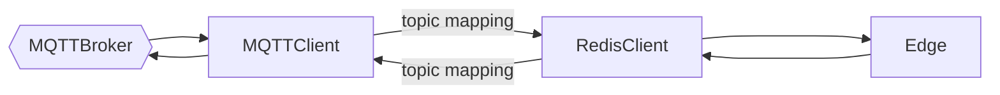

# 📬 Message Gateway Service

A lightweight, extensible gateway that bridges inbound and outbound messaging systems. Designed for hybrid **Edge** and **Cloud** deployments, it enables seamless, secure communication between MQTT and Redis-based systems.

---

## 🌐 Overview

The Message Gateway Service enables real-time, bi-directional message exchange across distributed systems by bridging **MQTT** and **Redis Pub/Sub** protocols. It supports secure communication, automatic reconnection, and is optimized for edge computing and cloud scalability.

---

## 🔑 Key Features

### ✅ MQTT Integration
- **MQTT v3 & v5 Support**: Full compliance with MQTT 3.x and 5.x.
- **WebSocket Support**: Browser-friendly and firewall-tolerant communication.
- **Authentication & Security**:
  - ACL-style access control.
  - **Mutual TLS (mTLS)** for secure, certificate-based authentication.

### ✅ Redis Pub/Sub Integration
- **Real-time Routing**: Lightweight and fast message delivery using Redis channels.
- **Security**:
  - ACL-based user authentication.
  - Optional **mTLS** support.
- **Health Monitoring**: Ensures Redis availability with active connection checks.

### ✅ Robustness
- **Auto-Reconnect**: Persistent connections to both Redis and MQTT brokers, even during network disruptions.

### ✅ Hybrid Deployment Ready
- Designed for **Edge** and **Cloud** environments.
- Supports **horizontal scalability**, enabling high availability and load balancing.

---

## 🚧 Coming Soon: Topic Mapping
*Configurable translation between MQTT topics and Redis channels.*

Planned features:
- Flexible routing rules
- Topic aliasing and transformation
- Regex-based matching

---

## ⚙️ Prerequisites

### 1. Redis Setup
- Version **6.0+** recommended for ACL and TLS support.
- Install and configure Redis (`redis.conf` for auth and TLS settings).

### 2. MQTT Broker
- Any broker supporting MQTT 3.x/5.x. Example:
  - Eclipse Mosquitto
- Configure `mosquitto.conf` for:
  - Auth (via pwfile)
  - TLS / mTLS (optional)

### 3. Authentication (Optional)
- **MQTT**:
  - Username/password via pwfile
- **Redis**:
  - User/password via ACL

### 4. Self-signed Certificates for mTLS (Optional)
To enable secure mutual TLS (mTLS) communication, you will need the following certificates:

- CA certificate
- Server certificate & key (for MQTT/Redis)
- Client certificate & key (for gateway)

> [!NOTE]
> Ensure private key files have secure permissions (chmod 600) and are owned by the correct service user (e.g., redis, mosquitto).
Additionally, the CA used for MQTT must be trusted by the MQTT client and broker.

If you just want to set things up quickly for testing purposes, run:

```bash
# For testing only
./init_setup.sh
```

> [!NOTE]
> This script generates the required certificates, adjusts their ownership and permissions, and copies them to the default paths—including config.toml for the message gateway.
Superuser permissions are required.

## 🧩 Configuration

The gateway is configured via two main sections:

### 🔧 Cloud (MQTT) Configuration

| Field                | Description                                 |
|----------------------|---------------------------------------------|
| `client_id`          | Unique identifier for MQTT connection       |
| `mqtt_version`       | "V3" or "V5"                                 |
| `broker` / `port`    | MQTT broker address and port                |
| `protocol`           | "tcp" (default) or "ws"                     |
| `topics`             | List of MQTT topics to subscribe            |
| `auth`               | Basic or mTLS                               |
| `username/password`  | For Basic Auth                              |
| `ca_cert`, `client_cert`, `client_key` | Paths for mTLS             |

### 🔧 Edge (Redis) Configuration

| Field                | Description                                 |
|----------------------|---------------------------------------------|
| `broker` / `port`    | Redis server address and port               |
| `database`           | Redis DB index                              |
| `channels`           | Redis channels to subscribe                 |
| `auth`               | Basic or mTLS                               |
| `username/password`  | For Basic Auth                              |
| `ca_cert`, `client_cert`, `client_key` | Paths for mTLS             |

---

## 🚀 Build & Launch

### 🛠️ Build from Source

**Compile:**

```bash
cargo build --release
```

**Run:**

```bash
./target/release/message-gateway
```
> Replace with debug if using non-optimized builds.

🐳 Docker

**Build Image:**

```bash
docker build -t message-gateway .
```

**Run with Docker Compose:**

```base
docker compose up -d
```
> Ensure the docker-compose.yml is properly configured with MQTT, Redis and Message Gateway and volumes for certs/configs.

## 🚦 Usage

Once running, messages published to a configured MQTT topic will be bridged to the corresponding Redis channel, and vice versa, enabling bi-directional communication.

## 🧭 Architecture Overview

