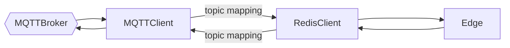

# Message Gateway Service

A lightweight gateway bridging inbound and outbound messaging systems, supporting communication across Edge and Cloud environments.

# Overview

This service facilitates seamless interaction between messaging protocols like MQTT and Redis, enabling flexible and reliable message exchange between distributed systems.

Key Features:
* MQTT v3 Support — Publish and subscribe to topics via any standard MQTT broker.
* Auto-Reconnect — Resilient reconnection logic for both MQTT and Redis.
* Redis Pub/Sub — Real-time message routing using Redis channels.
* Edge & Cloud Ready — Designed for hybrid environments.
* Topic Mapping — Supports configurable topic translation between protocols (coming soon).

## Features
* MQTT Integration
  * Connects to MQTT v3 brokers for message exchange.
  * Handles automatic reconnection on failure.
* Redis Integration
  * Uses Redis Pub/Sub for internal message routing.
  * Reconnects automatically on connection loss.
* Topic Mapping
  * Configure topic translation between MQTT and Redis channels.
* Cross-Environment Compatibility
  * Deployable in both Edge and Cloud environments.
  * Scales horizontally.

## Usage

### Prerequisites

Install Redis. For MQTT testing, use a public broker or host your own (e.g., Mosquitto).

### Configuration

TBD

### Installation

* Compile Service

```bash
cargo build --release
```

* Launch service:

```bash
./target/release/message_gateway_service 
```

### Docker


## Overview



